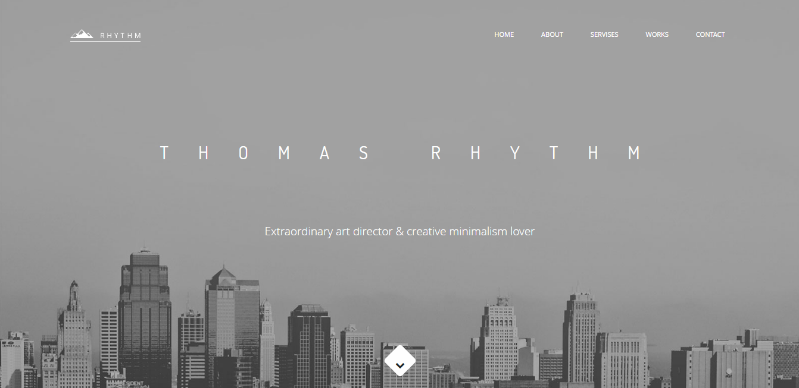

<h1>Verstka Bootstrap4 - test project</h1>

	

	Author: Shipica Maksim

## clone the project:

git clone  https://github.com/ShipaM/lesson12git.git

## upload npm packages

npm instal

## Create build folder and run server:

gulp server
